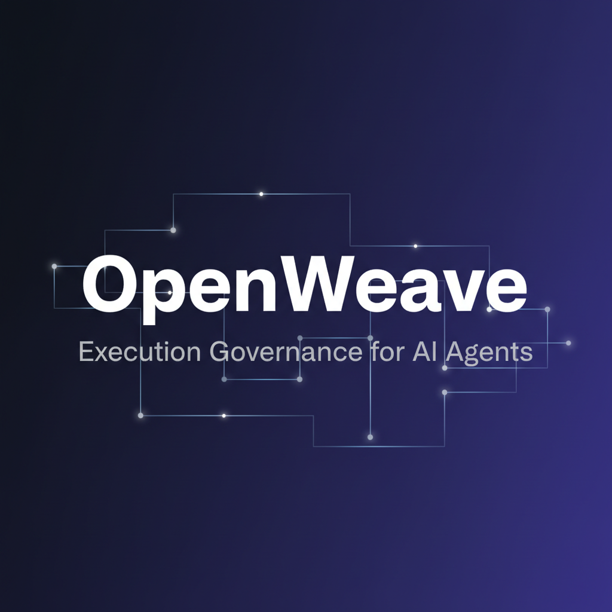

<p align="center">
  
</p>

<h1 align="center">OpenWeave</h1>
<p align="center"><strong>Execution Governance for AI Agents & Autonomous Systems</strong></p>

[](LICENSE)
[](https://github.com/sevenolives/openweave/actions)

OpenWeave is a state machine that controls what AI agents can do and when. Define workflows, enforce transitions, and require human approval at critical steps — all server-side.

**[Live Demo](https://openweave.dev/demo)** · **[Docs](https://openweave.dev/docs)** · **[Hosted Version](https://openweave.dev)**

---

## Why

Monitoring tools tell you what agents did. OpenWeave **prevents** what they shouldn't do.

- Agents discover allowed transitions from the API — no hardcoded workflows
- Approval gates block bots from entering critical states without human sign-off
- Every state change is enforced server-side with a hard 403
- Full audit trail of every action

## Features

- **State Machine Engine** — define states, transitions, and who can trigger them (bot/human/both)
- **Approval Gates** — mark states that require human approval before bots can enter
- **Workspace Isolation** — multi-tenant with full data separation
- **Project Management** — tickets, assignments, priorities, comments with @mentions
- **Audit Logging** — every change tracked with who, what, when
- **REST API** — standard Django REST Framework, OpenAPI docs included
- **Bot-Ready** — agents authenticate via JWT and discover their workflow from the API

## Quick Start

```bash
git clone https://github.com/sevenolives/openweave.git
cd openweave
cp .env.example .env
docker compose up
```

Then open:
- **Frontend:** http://localhost:3000
- **Backend API:** http://localhost:8000/api/
- **Admin:** http://localhost:8000/admin/ (admin / admin123)
- **API Docs:** http://localhost:8000/api/docs/

## Architecture

```
┌─────────────┐     ┌──────────────┐     ┌──────────┐
│   Next.js   │────▶│  Django API  │────▶│ Postgres │
│  Frontend   │     │   Backend    │     │    DB    │
└─────────────┘     └──────────────┘     └──────────┘
                           │
                    ┌──────┴──────┐
                    │ State Machine│
                    │   Engine     │
                    └─────────────┘
```

**Stack:** Django 6 + Django REST Framework · Next.js 15 + React 19 · PostgreSQL 16

## API Overview

| Endpoint | Description |
|----------|-------------|
| `POST /api/auth/login/` | JWT authentication |
| `GET /api/workspaces/` | List workspaces |
| `GET /api/projects/?workspace=X` | List projects |
| `GET /api/tickets/?project=X` | List tickets |
| `PATCH /api/tickets/{id}/` | Update ticket (status changes enforced) |
| `GET /api/status-definitions/?workspace=X` | Get available states |
| `GET /api/status-transitions/?workspace=X` | Get allowed transitions |
| `GET /api/comments/?ticket=X` | Ticket comments |
| `POST /api/media/` | Upload images/video/audio |

Full OpenAPI docs at `/api/docs/`.

## How Agents Work

1. Agent authenticates: `POST /api/auth/login/`
2. Discovers allowed transitions: `GET /api/status-transitions/?workspace=X`
3. Picks up a ticket: `PATCH /api/tickets/{id}/ {"status": "IN_SPEC", "assigned_to": self.id}`
4. Works through states following the transition rules
5. Hits approval gate → gets 403 → waits for human to approve
6. Human approves → agent continues

## Development

```bash
# Backend
cd backend
python -m venv venv && source venv/bin/activate
pip install -r requirements.txt
python manage.py migrate
python manage.py createsuperadmin
python manage.py runserver

# Frontend
cd frontend
npm install
npm run dev
```

See [CONTRIBUTING.md](CONTRIBUTING.md) for full dev setup guide.

## License

[Business Source License 1.1](LICENSE) — free to use, source available. Converts to Apache 2.0 on 2029-03-14.

Production use with more than 5 users requires a [commercial license](https://openweave.dev).
